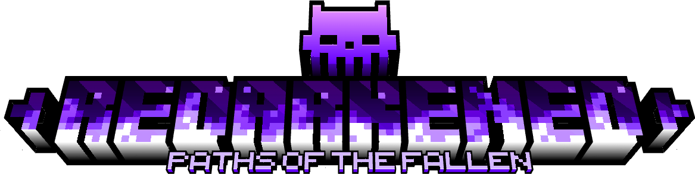
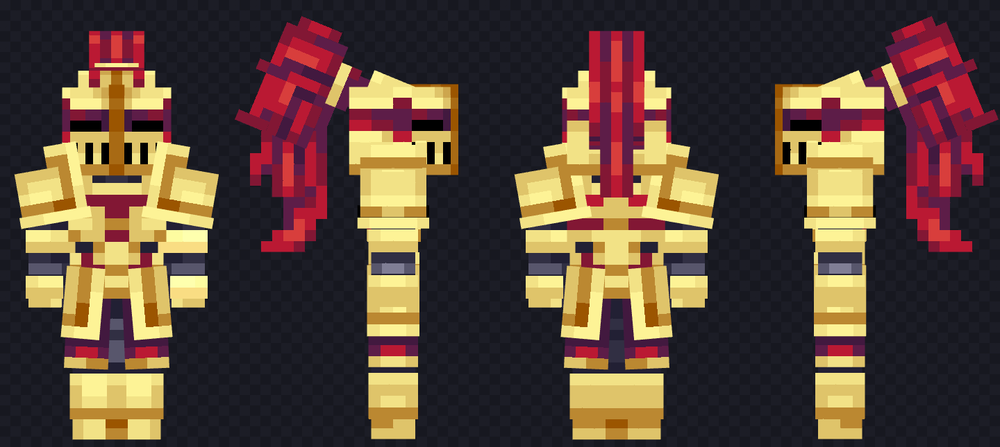

*The world breaks. You broke it.*

**Requires:**

---

Redarkened is a Minecraft 1.20.1 Fabric mod that transforms survival into a class-based action RPG with a reactive, evolving world.

Defeat the Ender Dragon. The game does not end. The world starts breaking, and every boss you slay after that makes it worse.
Six classes. Twelve subclasses. 
A corruption that remembers what you did. 
And something waiting at the center of the world that you built yourself.

> *"He is the earth you walked on. The earth you have just broken."*

---

### What to expect

- A full class system with meaningful subclass choices that change how you play
- Active abilities built around cooldowns and decision-making, not stat buffs
- A world that reacts to your progress in visible, permanent ways
- Bosses that demand adaptation, not memorization
- A Guild that records your failures and gives them back to you as knowledge
- An endgame that reflects the choices you made to get there

*Details, lore, and mechanics are intentionally left for you to discover in-game

---

### Small model showcase

---

### Contributing

This project is in active development. If you'd like to contribute, please open an issue before starting work on anything significant so we can discuss direction first.

Bug reports and feedback are very welcome.

Or if you wanna work on the mod, contact me on [discord](https://discord.com/users/595131602556944384)

---

### Credits

- [Unused textures repo](https://github.com/malcolmriley/unused-textures/tree/master)
- [MichealCreeper's mob story inspiration](https://www.artstation.com/michaelcreeper)

---

*REDARKENED - v0.1 - Work in Progress*

